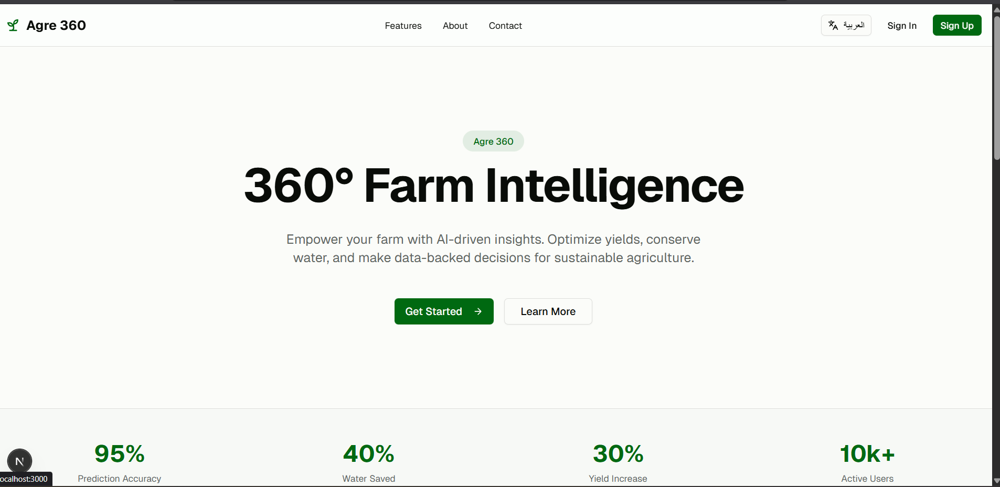
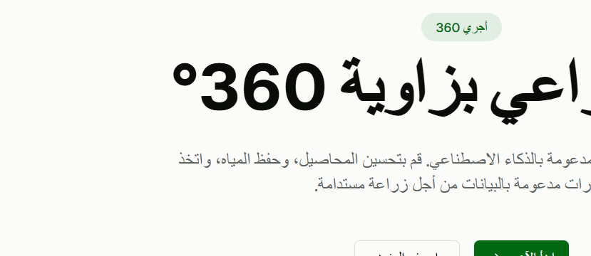
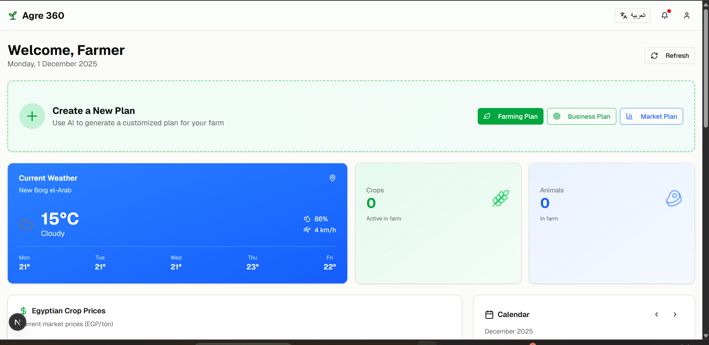
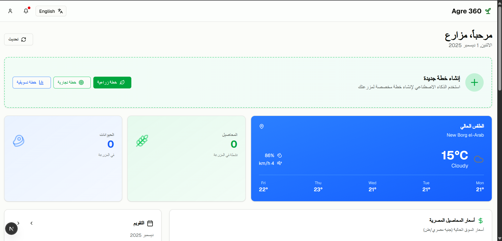
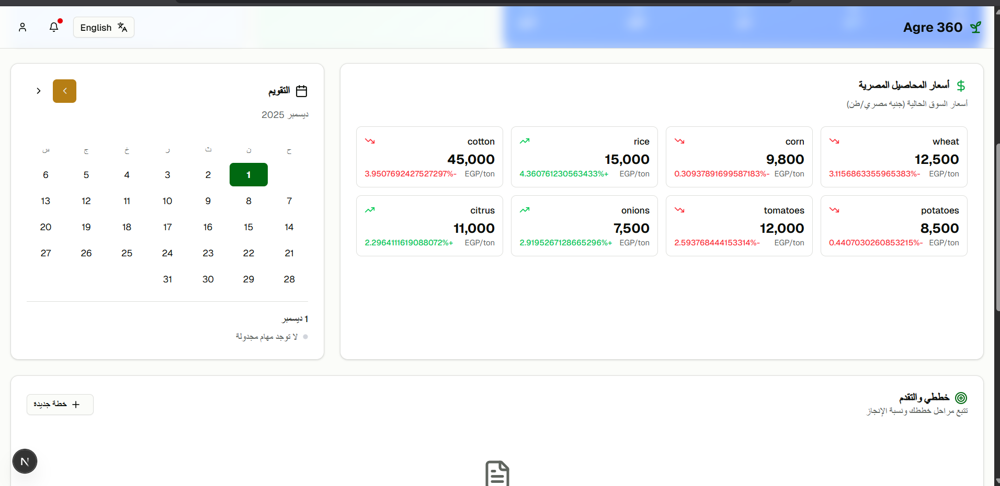
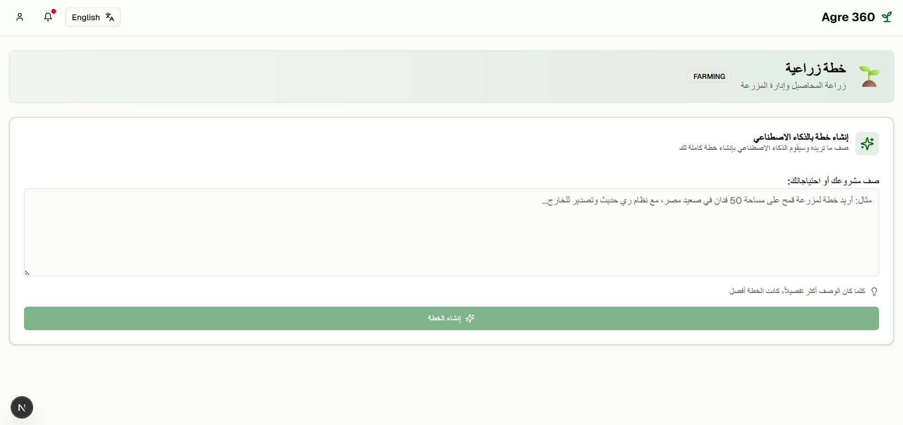

# 🌾 Agri360 - Smart Agricultural Management Platform

<div align="center">


[](https://nextjs.org/)
[](https://nodejs.org/)
[](https://www.mongodb.com/)
[](https://openai.com/)
[](LICENSE)

**An AI-powered agricultural management platform for Egyptian farmers**

[Demo](#demo) • [Features](#features) • [Installation](#installation) • [API Documentation](#api-documentation) • [Contributing](#contributing)

</div>

---

## 📋 Table of Contents

- [Overview](#overview)
- [Features](#features)
- [Tech Stack](#tech-stack)
- [Project Structure](#project-structure)
- [Installation](#installation)
- [Environment Variables](#environment-variables)
- [Running the Application](#running-the-application)
- [API Documentation](#api-documentation)
- [Screenshots](#screenshots)
- [Contributing](#contributing)
- [License](#license)

---

## 🌟 Overview

**Agri360** is a comprehensive agricultural management platform designed specifically for Egyptian farmers. It leverages artificial intelligence to provide smart farming recommendations, business planning, market analysis, and real-time insights to maximize agricultural productivity and profitability.

### Key Highlights

- 🤖 **AI-Powered Planning** - Generate detailed farming, business, and marketing plans using advanced AI
- 🌍 **Bilingual Support** - Full Arabic and English language support
- 📊 **Real-time Market Data** - Live Egyptian crop prices from Mahsoly API
- 🌤️ **Weather Integration** - Location-based weather forecasts for informed decisions
- 📱 **Responsive Design** - Works seamlessly on desktop and mobile devices

---

## ✨ Features

### 🌱 Farm Management

- Create and manage multiple farms
- Track crops and livestock
- Monitor farm statistics and performance
- Soil and water resource management

### 📝 AI Plan Generation

Generate comprehensive plans tailored to your needs:

| Plan Type            | Description                    | Use Case                              |
| -------------------- | ------------------------------ | ------------------------------------- |
| **🌾 Farming Plan**  | Crop cultivation strategies    | "I want to grow wheat on 50 acres"    |
| **💼 Business Plan** | Investment and operations      | "I want to buy 2 cows for dairy"      |
| **📈 Market Plan**   | Sales and marketing strategies | "I have 100 tons of rice to sell"     |
| **🐄 Animal Plan**   | Livestock management           | "Raise 50 cattle for beef production" |
| **🏡 Mixed Plan**    | Integrated farming operations  | "Combined crop and animal farm"       |

### 📊 Dashboard Features

- Real-time weather updates
- Egyptian crop price monitoring
- Plan progress tracking with phases
- Interactive calendar with farming events
- Quick statistics and insights

### 🛒 Marketplace

- List products for sale
- Browse available agricultural products
- Connect with buyers and sellers
- Price comparison tools

### 💬 AI Chat Assistant

- Get instant farming advice
- Ask questions in Arabic or English
- Context-aware responses
- Agricultural expertise on demand

---

## 🛠️ Tech Stack

### Frontend

| Technology       | Purpose                         |
| ---------------- | ------------------------------- |
| **Next.js 16**   | React framework with App Router |
| **TypeScript**   | Type-safe development           |
| **Tailwind CSS** | Utility-first styling           |
| **shadcn/ui**    | UI component library            |
| **Recharts**     | Data visualization              |
| **Lucide Icons** | Beautiful icons                 |

### Backend

| Technology     | Purpose             |
| -------------- | ------------------- |
| **Node.js**    | Runtime environment |
| **Express.js** | Web framework       |
| **MongoDB**    | Database            |
| **Mongoose**   | ODM for MongoDB     |
| **JWT**        | Authentication      |

### AI & APIs

| Service           | Purpose                |
| ----------------- | ---------------------- |
| **OpenRouter AI** | Plan generation & chat |
| **Mahsoly API**   | Egyptian crop prices   |
| **Weather API**   | Weather forecasts      |

---

## 📁 Project Structure

```
agri360/
├── 📂 Agri360 backend/          # Backend API server
│   ├── 📂 ai/                   # AI agent and tools
│   │   ├── agent/               # AI planning agent
│   │   ├── schemas/             # Zod validation schemas
│   │   └── tools/               # AI tools (weather, prices)
│   ├── 📂 config/               # Configuration files
│   ├── 📂 controllers/          # Route controllers
│   ├── 📂 middleware/           # Express middleware
│   ├── 📂 models/               # Mongoose models
│   ├── 📂 routes/               # API routes
│   ├── 📂 services/             # Business logic
│   ├── 📂 utils/                # Utility functions
│   └── server.js                # Entry point
│
├── 📂 Agri360frontend/           # Frontend application
│   ├── 📂 app/                  # Next.js App Router pages
│       │   ├── dashboard/       # Dashboard pages
│       │   ├── planning/        # Plan creation
│       │   ├── farms/           # Farm management
│       │   ├── chat/            # AI chat
│   │   └── ...
│   ├── 📂 components/           # React components
│   │   ├── ui/                  # shadcn/ui components
│   │   ├── plan-editor.tsx      # AI plan generator
│   │   └── ...
│   ├── 📂 contexts/             # React contexts
│   ├── 📂 lib/                  # Utilities & API client
│   └── 📂 public/               # Static assets
│
├── 📄 README.md                 # This file
└── 📄 start-servers.ps1         # Server startup script
```

---

## 🚀 Installation

### Prerequisites

- **Node.js** 18.x or higher
- **MongoDB** (local or Atlas)
- **npm** or **yarn**
- **Git**

### Clone the Repository

```bash
git clone https://github.com/mohamedkhaled110/Agri360.git
cd Agri360
```

### Install Dependencies

```bash
# Install backend dependencies
cd "Agri360 backend"
npm install

# Install frontend dependencies
cd "../Agri360frontend"
npm install
```

---

## ⚙️ Environment Variables

### Backend (`Agri360 backend/.env`)

```env
# Server
PORT=5000
NODE_ENV=development

# MongoDB
MONGODB_URI=mongodb+srv://your-connection-string

# JWT
JWT_SECRET=your-super-secret-jwt-key
JWT_EXPIRE=30d

# AI Services
OPENROUTER_API_KEY=your-openrouter-api-key

# External APIs
MAHSOLY_API_KEY=your-mahsoly-api-key
WEATHER_API_KEY=your-weather-api-key
```

### Frontend (`Agri360frontend/.env.local`)

```env
NEXT_PUBLIC_API_URL=http://localhost:5000/api
```

---

## 🏃 Running the Application

### Option 1: Using PowerShell Script (Windows)

```powershell
.\start-servers.ps1
```

### Option 2: Manual Start

**Terminal 1 - Backend:**

```bash
cd "Agri360 backend"
npm start
# or for development:
node server.js
```

**Terminal 2 - Frontend:**

```bash
cd "Agri360frontend"
npm run dev
```

### Access the Application

- **Frontend:** http://localhost:3000
- **Backend API:** http://localhost:5000/api

---

## 📚 API Documentation

### Authentication

| Endpoint             | Method | Description       |
| -------------------- | ------ | ----------------- |
| `/api/auth/register` | POST   | Register new user |
| `/api/auth/login`    | POST   | Login user        |
| `/api/auth/me`       | GET    | Get current user  |

### Farms

| Endpoint             | Method | Description     |
| -------------------- | ------ | --------------- |
| `/api/farms`         | GET    | List all farms  |
| `/api/farms`         | POST   | Create farm     |
| `/api/farms/my-farm` | GET    | Get user's farm |
| `/api/farms/:id`     | PUT    | Update farm     |
| `/api/farms/:id`     | DELETE | Delete farm     |

### Business Plans

| Endpoint             | Method | Description        |
| -------------------- | ------ | ------------------ |
| `/api/business`      | GET    | List user's plans  |
| `/api/business`      | POST   | Generate AI plan   |
| `/api/business/save` | POST   | Save approved plan |
| `/api/business/:id`  | GET    | Get plan details   |
| `/api/business/:id`  | PUT    | Update plan        |
| `/api/business/:id`  | DELETE | Delete plan        |

### Chat

| Endpoint            | Method | Description        |
| ------------------- | ------ | ------------------ |
| `/api/chat`         | POST   | Send message to AI |
| `/api/chat/history` | GET    | Get chat history   |

### Market

| Endpoint               | Method | Description              |
| ---------------------- | ------ | ------------------------ |
| `/api/market/prices`   | GET    | Get crop prices          |
| `/api/market/listings` | GET    | Get marketplace listings |

---

## 📸 Screenshots

### 🏠 Landing Page

<div align="center">

| English                                             | العربية                                            |
| --------------------------------------------------- | -------------------------------------------------- |
|  |  |

</div>

> Modern, responsive landing page with bilingual support (English/Arabic)

### 🔐 Authentication

<div align="center">

| English                                       | العربية                                      |
| --------------------------------------------- | -------------------------------------------- |
|  |  |

</div>

> Secure authentication with RTL support for Arabic users

### 📊 Dashboard

<div align="center">

| English                                            | العربية                                           |
| -------------------------------------------------- | ------------------------------------------------- |
|  |  |

</div>

> Real-time weather updates, crop prices, calendar, and farm statistics

---

## 🤝 Contributing

Contributions are welcome! Please follow these steps:

1. **Fork** the repository
2. **Create** a feature branch (`git checkout -b feature/AmazingFeature`)
3. **Commit** your changes (`git commit -m 'Add some AmazingFeature'`)
4. **Push** to the branch (`git push origin feature/AmazingFeature`)
5. **Open** a Pull Request

### Development Guidelines

- Follow the existing code style
- Write meaningful commit messages
- Add tests for new features
- Update documentation as needed

---

## 📄 License

This project is licensed under the MIT License - see the [LICENSE](LICENSE) file for details.

---

## 👨‍💻 Author

**Mohamed Khaled Yahya**

- GitHub: [@mohamedkhaled110](https://github.com/mohamedkhaled110)

---

## 🙏 Acknowledgments

- [Mahsoly](https://mahsoly.com/) - Egyptian agricultural price data
- [OpenRouter](https://openrouter.ai/) - AI model routing
- [shadcn/ui](https://ui.shadcn.com/) - Beautiful UI components
- Egyptian Ministry of Agriculture - Crop guidelines

---

<div align="center">

**Made with ❤️ for Egyptian Farmers**


</div>
